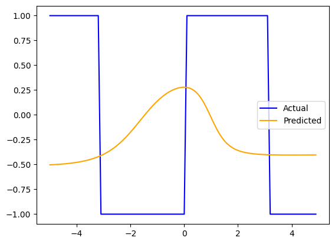
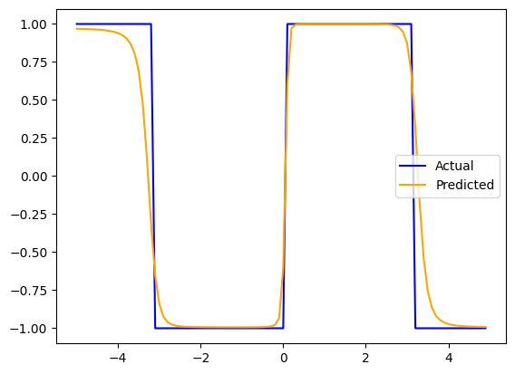
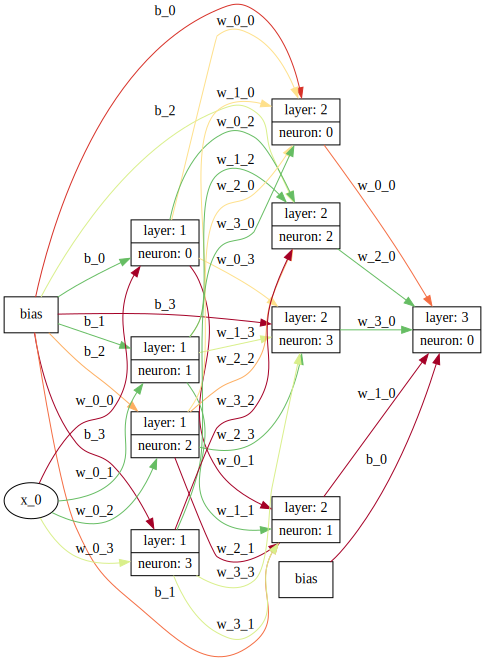

# nanograd

<!-- WARNING: THIS FILE WAS AUTOGENERATED! DO NOT EDIT! -->

## Install

    git clone https://github.com/vempaliakhil96/nanograd.git && cd nanaograd
    pip install .

## How to use

``` python
from nanograd.nn import MLP, plot_preds
import numpy as np
import math
```

## Let’s generate a random dataset

Generating few samples of a sine wave

``` python
samples = [(i, 1 if math.sin(i)>0 else -1) for i in np.arange(-5, 5, 0.1)]

xs, ys = zip(*samples)
xs, ys = list(xs), list(ys)
```

## Initialise MLP

``` python
model = MLP(1, [4, 4, 1])
model.draw_nn()
```


### Perdictions before training

``` python
y_preds = [model([x])[0] for x in xs]
plot_preds(xs, ys, [i.data for i in y_preds])
```



## Training loop

``` python
def calc_loss_and_accuracy(model, X, Y):
    y_preds = [model([x])[0] for x in X]
    loss = sum([(y_preds[i] - Y[i])**2 for i in range(len(Y))])/len(Y) # MSE
    y_preds = [1 if y_preds[i].data > 0.5 else 0 for i in range(len(Y))]
    accuracy = sum([1 if y_preds[i] == Y[i] else 0 for i in range(len(Y))])/len(Y)
    return loss, accuracy
calc_loss_and_accuracy(model, xs, ys)
```

    (Value(data=1.23e+00, grad=0.00e+00, label=), 0.0)

``` python
for i in range(1000):
    
    # forward pass
    loss, accuracy = calc_loss_and_accuracy(model, xs, ys)
    
    
    # backward pass
    model.zero_grad()
    loss.backward()

    # update weights
    for p in model.parameters():
        p.data += -0.1 * p.grad
    
    if i % 100 == 0:
        print(f"Loss at epoch {i:.3f}: {loss.data:.3f} | Accuracy: {accuracy:.3f}")
```

    Loss at epoch 0.000: 1.231 | Accuracy: 0.000
    Loss at epoch 100.000: 0.554 | Accuracy: 0.220
    Loss at epoch 200.000: 0.260 | Accuracy: 0.370
    Loss at epoch 300.000: 0.147 | Accuracy: 0.420
    Loss at epoch 400.000: 0.117 | Accuracy: 0.440
    Loss at epoch 500.000: 0.099 | Accuracy: 0.450
    Loss at epoch 600.000: 0.087 | Accuracy: 0.450
    Loss at epoch 700.000: 0.079 | Accuracy: 0.470
    Loss at epoch 800.000: 0.072 | Accuracy: 0.470
    Loss at epoch 900.000: 0.067 | Accuracy: 0.470

## Predictions

``` python
y_preds = [model([x])[0] for x in xs]
plot_preds(xs, ys, [i.data for i in y_preds])
```



Notice the strength of the connections has changed.

``` python
model.draw_nn()
```


